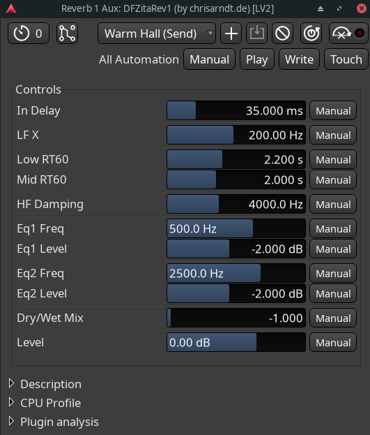

# DF Zita Rev1

A feedback-delay-network reverb plugin built with [DPF] and based on a [FAUST]
library demo.

## Formats

This plugin is available in the following plug-in formats by default:

* [CLAP] (`de.chrisarndt.dfzitarev1`)
* [LV2] (`https://chrisarndt.de/plugins/dfzitarev1`)
* [VST3][vst] (`dfzitarev1.vst3`)

The following formats are not built by default, but can be enabled when
compiling (see ["Compiling"](#compiling)):

* [LADSPA] (`dfzitarev1-ladspa.so`)
* [VST2][vst] (`dfzitarev1-vst.so`)

The plugin depends on the host to provide a generic UI to control parameters.

## Compiling

Make sure you have installed the required build tools and libraries (see
section "Prerequisites" below) and then clone this repository (including
sub-modules) and simply run `make` in the project's root directory:

    $ git clone --recursive https://github.com/SpotlightKid/dfzitarev1.git
    $ cd dfzitarev1
    $ make

To enable building additional plugin formats, which are not enabled by default
(LADSPA, VST2), pass `BUILD_LADSPA=true` resp. `BUILD_VST2=true` to make. For
example:

    make BUILD_VST2=true

The same settings must be passed to `make install` to also install optional
plugin formats.

## Installation

To install all plugin formats to their appropriate system-wide location, run
the following command (root priviledges may be required):

    make install

The makefiles support the usual `PREFIX` and `DESTDIR` variables to change the
installation prefix and set an installation root directory (defaulty: empty).
`PREFIX` defaults to `/usr/local`, but on macOS and Windows it is not used,
since the system-wide installation directories for plugins are fixed.

Use make's `-n` option to see where the plugins would be installed without
actually installing them.

You can also set the installation directory for each plugin format with a
dedicated makefile variable.

* CLAP: `CLAP_DIR` (`<prefix>/lib/clap`)
* LADSPA: `LADSPA_DIR` (`<prefix>/lib/ladspa`)
* LV2: `LV2_DIR` (`<prefix>/lib/lv2`)
* VST2: `VST_DIR` (`<prefix>/lib/vst`)
* VST3: `VST3_DIR` (`<prefix>/lib/vst3`)

Example: `make DESTDIR=/tmp/build-root VST_DIR=/usr/lib/lxvst install`

To install the plugins only for your current user account, run
`make install-user`.

Again, you can also set the installation directory for each plugin format with
a dedicated makefile variable.

* CLAP: `USER_CLAP_DIR` (`$HOME/.clap`)
* LADSPA: `USER_LADSPA_DIR` (`$HOME/.ladspa`)
* LV2: `USER_LV2_DIR` (`$HOME/.lv2`)
* VST2: `USER_VST_DIR` (`$HOME/.vst`)
* VST3: `USER_VST3_DIR` (`$HOME/.vst3`)

*Note: The given default values for all of the above listed makefile
variables differ depending on the target OS.*

## Prerequisites

* The GCC C++ compiler, library and the usual associated software build tools
  (`make`, etc.).

  Debian / Ubuntu users should install the `build-essential` package
  to get these, Arch users the `base-devel` meta package.

* `patch`

* [pkgconf]

* The [faustpp] pre-processor and [FAUST] (optional)

The [CLAP], [LV2], [LADSPA], [VST2][vst] (Xaymar VST2SDK) and [VST3][vst]
headers are included in the [DPF] framework, which is integrated as a Git
sub-module. These need not be installed separately to build the software in
the respective plug-in formats.

`faustpp` and FAUST are only needed to re-generate C++ source and header files
if the FAUST DSP source files in the `faust` directory are changed.

## Author

This software was put together by *Christopher Arndt*.

## License

This plugin is released under the *MIT License*. Please see the
[LICENSE.md](./LICENSE.md) file for details.

## Acknowledgements

The DSP code is generated from the FAUST sources via the [faustpp]
pre-processor and uses the [dm.zita_rev1] demo from the FAUST library, written
by Julius O. Smith III [^1], which is a re-implementation of [zita-rev1] by Fons
Adriaensen, writen in C++.

The project is built using the DISTRHO Plugin Framework ([DPF]) and set up
with the [cookiecutter-dpf-faust] project template.

[^1]: https://ccrma.stanford.edu/~jos/book2000/Zita_Rev1.html

[clap]: https://cleveraudio.org/
[cookiecutter-dpf-faust]: https://github.com/SpotlightKid/cookiecutter-dpf-faust
[dm.zita_rev1]: https://faustlibraries.grame.fr/libs/demos/#dmzita_rev1
[dpf]: https://github.com/DISTRHO/DPF
[faust]: https://faust.grame.fr/
[faustpp]: https://github.com/jpcima/faustpp.git
[ladspa]: https://www.ladspa.org/
[lv2]: http://lv2plug.in/
[pkgconf]: https://github.com/pkgconf/pkgconf
[vst]: https://en.wikipedia.org/wiki/Virtual_Studio_Technology
[zita-rev1]: https://kokkinizita.linuxaudio.org/linuxaudio/zita-rev1-doc/quickguide.html
